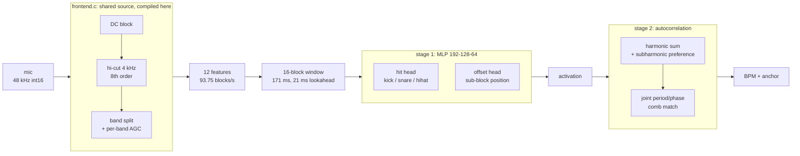

# 1: detector + autocorrelator

## Configuration

| | |
|---|---|
| front end | `FE_SPEC_VERSION 1`, variant `hicut` (2) |
| features | 12 per block, 10.667 ms/block |
| window | 16 blocks (171 ms), lookahead 2 (21.3 ms) |
| model | [128, 64] hidden, offset head true |
| size | 33,216 MAC/inference, ~32 KB int8 |
| augmentation | IR `data/ir/mic_preliminary.wav`, coil whine per PWM setting, -40..-6 dBFS |
| thresholds | kick 0.90, snare 0.85, hihat 0.75 |
| provenance | manifest `a9830eda7ba1`, IR `5279ea9dd9f4` |

## Dataset

| split | takes | blocks | hours | size | kick | snare | hihat |
|---|---|---|---|---|---|---|---|
| train | 2,382 | 2,846,052 | 8.43 | 244 MB | 33,864 | 34,896 | 67,923 |
| val | 297 | 369,396 | 1.09 | 32 MB | 4,206 | 4,548 | 8,004 |
| test | 276 | 323,631 | 0.96 | 28 MB | 4,092 | 4,341 | 7,827 |
| **total** | 2,955 | 3,539,079 | 10.49 | 304 MB | | | |

| manifest | | | | 58 MB | | | |
| tempo test (real loops) | 247 | | 1.37 | | | | |

## Onset detection: test split

| class | median | p90 | bias | F1 | precision | recall | n |
|---|---|---|---|---|---|---|---|
| kick | 1.51 ms | 4.38 ms | +0.05 ms | 0.816 | 0.847 | 0.788 | 4,092 |
| snare | 1.68 ms | 4.37 ms | +0.25 ms | 0.740 | 0.722 | 0.759 | 4,341 |
| hihat | 2.38 ms | 9.73 ms | +0.44 ms | 0.632 | 0.550 | 0.744 | 7,827 |

## Grid: tempo on real drum loops (period only)

| metric | value |
|---|---|
| tempo within 4% | 42.5% |
| tempo within 4% allowing octave/triplet | 79.8% |
| loops | 247 |

## Grid: rendered clips, exact grid (identical stage 2, 3 seeds)

| stage 2 input | tempo within 4% | +octave | phase median |
|---|---|---|---|
| this model's activation | 37.8% ±1.8 | 78.7% ±1.0 | 8.58 ms |
| beat activation (approach 2) | 40.1% ±0.2 | 79.2% ±1.0 | 8.66 ms |
| raw flux | 27.9% | 68.5% | 11.5 ms |
