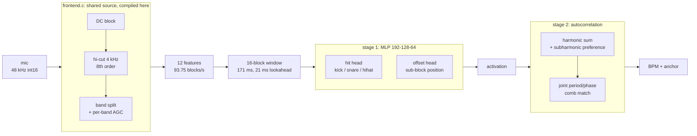
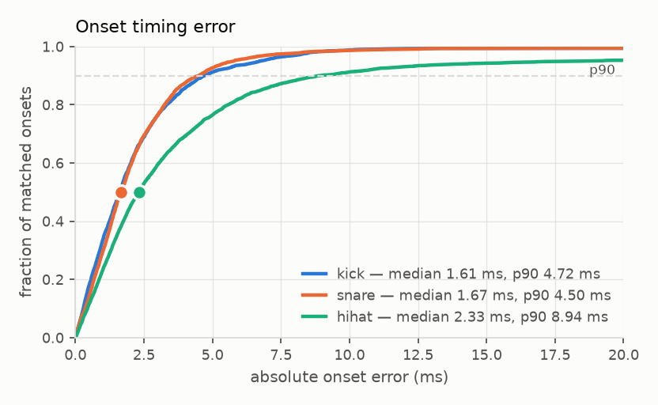
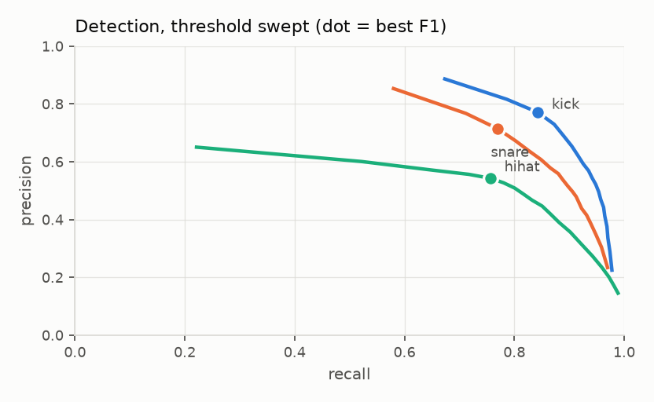
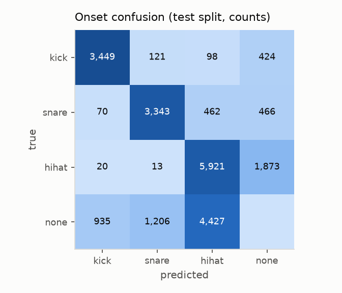
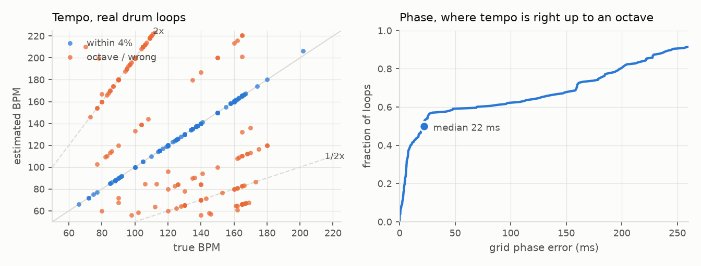

# 1: detector + autocorrelator

## Configuration

| | |
|---|---|
| front end | `FE_SPEC_VERSION 1`, variant `hicut` (2) |
| features | 12 per block, 10.667 ms/block |
| window | 16 blocks (171 ms), lookahead 2 (21.3 ms) |
| model | [128, 64] hidden, offset head true |
| size | 33,152 MAC/inference, ~32 KB int8 |
| augmentation | IR `data/ir/mic_preliminary.wav`, coil whine per PWM setting, -40..-6 dBFS |
| thresholds | kick 0.85, snare 0.85, hihat 0.75 |
| provenance | manifest `a9830eda7ba1`, IR `5279ea9dd9f4` |

## Dataset

| split | takes | blocks | hours | size | kick | snare | hihat |
|---|---|---|---|---|---|---|---|
| train | 2,382 | 2,846,052 | 8.43 | 212 MB | 33,864 | 34,896 | 67,923 |
| val | 297 | 369,396 | 1.09 | 27 MB | 4,206 | 4,548 | 8,004 |
| test | 276 | 323,631 | 0.96 | 24 MB | 4,092 | 4,341 | 7,827 |
| **total** | 2,955 | 3,539,079 | 10.49 | 263 MB | | | |

Manifest 58 MB. Tempo test set: 247 real drum loops, 1.37 h, disjoint from training.

## Onset detection test split

| class | median | p90 | bias | F1 | precision | recall | n |
|---|---|---|---|---|---|---|---|
| kick | 1.61 ms | 4.72 ms | +0.18 ms | 0.805 | 0.771 | 0.843 | 4,092 |
| snare | 1.67 ms | 4.46 ms | +0.25 ms | 0.741 | 0.714 | 0.770 | 4,341 |
| hihat | 2.35 ms | 9.83 ms | +0.38 ms | 0.632 | 0.543 | 0.756 | 7,827 |

## Grid: real drum loops

| metric | value |
|---|---|
| tempo within 4% | 44.1% |
| tempo within 4% allowing octave/triplet | 80.2% |
| phase error, median | 21.8 ms |
| phase error, p90 | 245.0 ms |
| loops | 247 |

## Stage 2 input, same loops

| input | tempo within 4% | +octave | phase median |
|---|---|---|---|
| model activation | 44.1% | 80.2% | 21.8 ms |
| thresholded onsets | 36.0% | 72.9% | 21.4 ms |
| raw flux | 37.7% | 78.1% | 18.1 ms |
