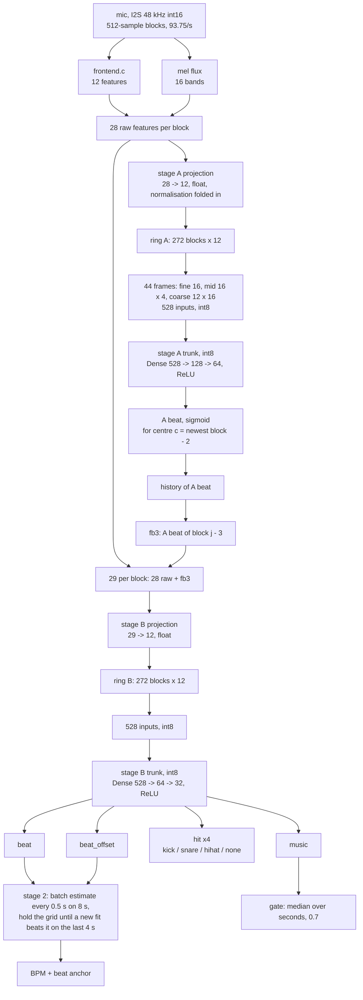
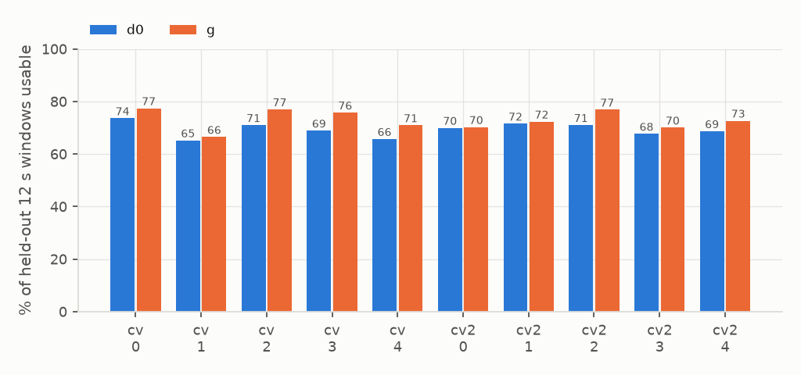
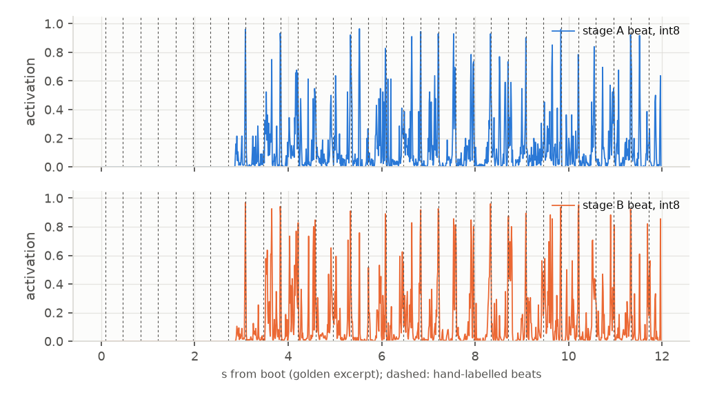

# 10: two-stage model g

## Configuration

|  |  |
|---|---|
| stage A | d0: projection 28 -> 12, MLP 528-128-64, beat head only in the export |
| stage B | projection 29 -> 12 (28 features + A beat shifted 3 blocks), MLP 528-64-32, heads beat, beat_offset, hit x4, music |
| feedback | A beat of block j - 3 as feature 28 of block j: the newest frame is t+2, the newest A output t-1; no added lookahead |
| MACs per block | 112,588 (projections 684, A 75,840, B 36,064) |
| int8 TFLite | A 83,728 B, B 43,400 B |
| deployed | firmware `74cba7b` (2026-09-29) |
| export | `export/twostage1`, A sha256 `7ce8fd6b98a4`, B `e62bbc4908f0` |
| runs | `runs/final3_d0_s0`, `runs/final3_g_s0`, trained on all 293 songs |
| training | B is trained on A's float activation over every corpus, A frozen; final pair on all 293 songs, 7 epochs fixed (the CV median best epoch), no early stopping |

## Feedback variants, 2 seeds, mel base with playlists (d0 control)

| run | added input | MACs incl. A | rendered usable | octave | melodic grid | songs test | songs val | playlists usable | re-lock median | old tempo, first 10 s | never re-locks | songs usable (stream) |
|---|---|---|---|---|---|---|---|---|---|---|---|---|
| d0 | - | 76,560 | 60.2 ±0.9 | 90.1 ±0.3 | 34.6 ±0.3 | 66.2 ±0.4 | 71.9 ±0.7 | 63.4 ±0.8 | 4.7 ±0.0 s | 2.7 ±0.0 s | 2.0 ±0.7 | 54.2 ±0.5 |
| e1, closed loop | own beat, shift 3 | 76,572 | 59.4 ±1.5 | 84.5 ±0.7 | 21.6 ±1.1 | 37.3 ±1.3 | 33.7 ±0.4 | 29.6 ±1.6 | 36.2 ±0.0 s | 2.2 ±0.3 s | 34.0 ±2.0 | 39.4 ±1.1 |
| e2, closed loop | own beat (trained on e1's), shift 3 | 76,572 | 51.9 ±2.3 | 87.9 ±0.8 | 32.9 ±0.3 | 59.2 ±1.3 | 60.7 ±3.7 | 61.6 ±0.1 | 4.8 ±0.1 s | 2.5 ±0.2 s | 6.0 ±0.7 | 52.3 ±0.7 |
| e1 fed d0 (two-stage) | d0 beat, shift 3 | 153,132 | 68.5 ±1.1 | 93.1 ±0.3 | 33.8 ±0.4 | - | - | 67.5 ±0.9 | 4.6 ±0.1 s | 2.0 ±0.2 s | 1.3 ±0.0 | - |
| f1 | d0 stream-tracker state | 153,168 | 61.9 ±0.3 | 91.1 ±0.0 | 34.8 ±0.5 | 66.2 ±0.4 | 73.0 ±0.4 | 64.6 ±0.0 | 5.9 ±0.0 s | 3.3 ±0.1 s | 4.0 ±0.0 | 57.1 ±0.2 |

Phase C (FE-only base, cascade from n_song): c1 with A's unshifted beat had 2 blocks of added lookahead; its gain is not comparable. Every run on this page except the final pair trained its music head on labels that were all 0 (see results/9); they compare with each other like for like. The final pair (`runs/final3_*`) has it fixed.

## 5-fold CV by artist, balanced by genre, one model per fold

| labels | model | MACs | songs | windows | usable | usable per fold | tempo exact | octave | songs usable (stream) | playlists usable | re-lock median | never re-locks |
|---|---|---|---|---|---|---|---|---|---|---|---|---|
| 172 | d0 | 76,560 | 173 | 2089 | 69.0 | 73.6 / 65.2 / 71.0 / 68.9 / 65.7 | 68.0 | 86.6 | 67.7 | 67.3 | 5.1 s | 7.2 |
| 172 | g, stage B 64-32 | 112,588 | 173 | 2089 | 73.7 | 77.4 / 66.5 / 77.0 / 75.8 / 71.0 | 76.2 | 89.9 | 70.9 | 69.8 | 5.4 s | 6.7 |
| 172 | h, stage B 128-64 | 153,132 | 173 | 2089 | 73.6 | 77.9 / 66.2 / 77.2 / 74.2 / 71.2 | 76.4 | 90.3 | 71.2 | 69.8 | 5.3 s | 7.2 |
| 293 | d0 | 76,560 | 293 | 3244 | 69.8 | 69.9 / 71.5 / 71.0 / 67.7 / 68.7 | 68.8 | 88.9 | 68.9 | 69.7 | 5.7 s | 4.9 |
| 293 | g, stage B 64-32 | 112,588 | 293 | 3244 | 72.7 | 70.2 / 72.3 / 76.9 / 70.0 / 72.7 | 75.7 | 91.6 | 71.6 | 71.3 | 5.3 s | 4.9 |

## Standard test sets, mean of the 5 fold models

| CV | model | rendered usable | rendered octave | drum tempo | melodic tempo | drum grid usable | melodic grid usable | rendered phase, ms |
|---|---|---|---|---|---|---|---|---|
| cv | d0 | 58.7 ±1.8 | 89.4 ±0.9 | 58.3 ±1.1 | 47.7 ±0.7 | 55.0 ±0.4 | 34.3 ±1.4 | 8.9 ±0.4 |
| cv | g | 65.3 ±0.9 | 92.7 ±0.5 | 62.9 ±0.5 | 50.9 ±0.5 | 58.5 ±0.7 | 35.1 ±0.7 | 9.2 ±0.2 |
| cv | h | 66.3 ±1.2 | 92.6 ±0.5 | 63.8 ±1.2 | 51.0 ±0.8 | 58.7 ±1.5 | 35.3 ±0.9 | 9.1 ±0.3 |
| cv2 | d0 | 59.1 ±1.5 | 90.0 ±1.0 | 58.0 ±1.0 | 47.8 ±0.7 | 55.4 ±0.5 | 34.0 ±0.9 | 9.3 ±0.1 |
| cv2 | g | 65.4 ±1.0 | 92.8 ±0.2 | 63.6 ±1.1 | 51.3 ±0.6 | 58.9 ±0.4 | 35.4 ±0.8 | 9.1 ±0.4 |

## Against v3 (music v3, `runs/m_cand_s0`, deployed before this model)

|  | v3 | two-stage |
|---|---|---|
| real songs, 12 s windows usable (293 songs; v3 never trained on songs, two-stage cross-validated) | 64.9 | 72.7 |
| playlists usable, hold 8 s | 65.4 | 71.3 |
| re-lock after a track change, median | 6.3 s | 5.3 s |
| never re-locks | 6.6 | 4.9 |
| rendered clips usable (v3 float, two-stage final int8) | 58.9 | 64.4 |
| drum loops tempo | 58.8 | 63.5 |
| drum loops grid usable | 54.5 | 61.5 |
| melodic loops tempo | 45.4 | 50.1 |
| melodic loops grid usable | 29.6 | 33.8 |
| MACs per block | 76,224 | 112,588 |

## Music gate, int8, val, per-take median of stage B music

| group |  | takes | v3 at 0.7 | two-stage at 0.7 | two-stage at 0.8 |
|---|---|---|---|---|---|
| real loops | kept | 660 | 84.9 | 88.6 | 80.5 |
| melodic | kept | 461 | 18.7 | 48.4 | 35.4 |
| rendered | kept | 1035 | 79.0 | 83.6 | 79.1 |
| songs | kept | 37 | - | 97.3 | 91.9 |
| non-music | rejected | 245 | 88.3 | 79.2 | 85.3 |
| silence | rejected | 24 | 100.0 | 100.0 | 100.0 |

## Export, float against int8, test splits, 461-block window

| test set | metric | float | int8 | beat correlation |
|---|---|---|---|---|
| clips | usable | 65.0 | 64.4 | 0.9937 |
| loops | tempo | 63.8 | 63.5 | 0.9957 |
| melodic | tempo | 51.1 | 50.1 | 0.9858 |
| loops_grid | usable | 60.7 | 61.5 | 0.9954 |
| melodic_grid | usable | 34.0 | 33.8 | 0.9858 |

