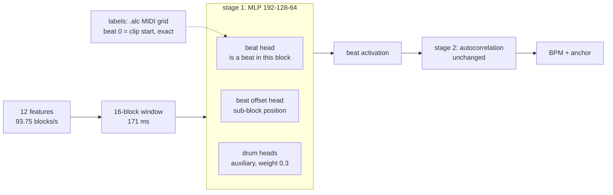
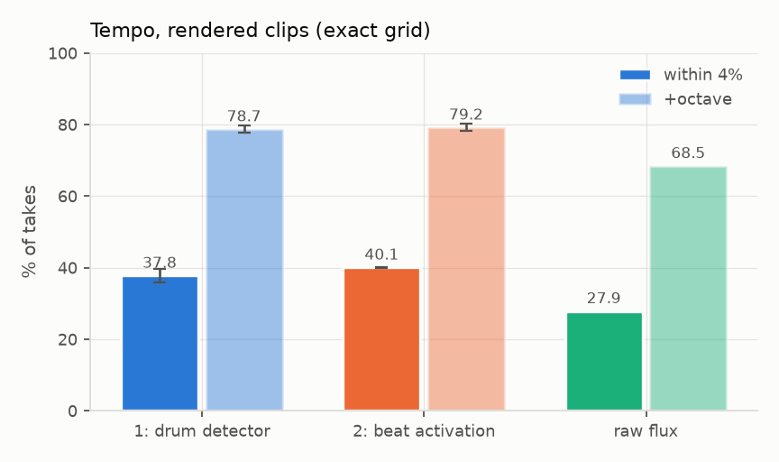
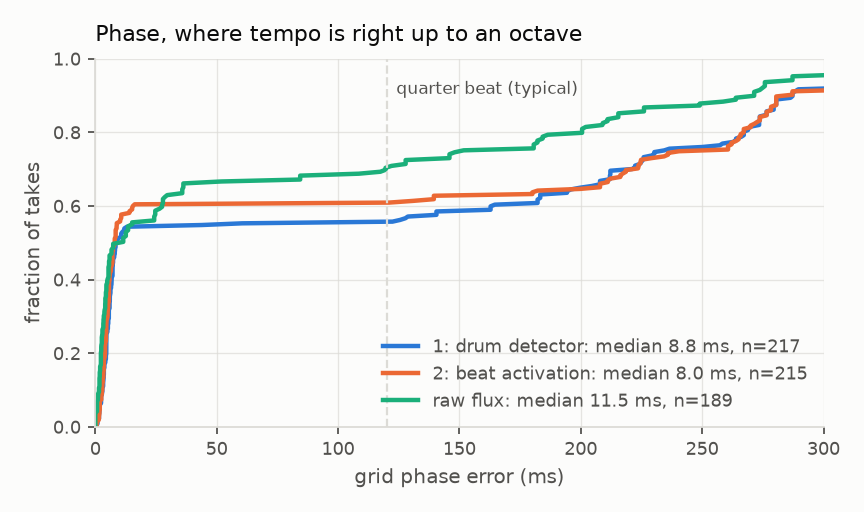

# 2: beat activation

## Configuration

| | |
|---|---|
| front end | `FE_SPEC_VERSION 1`, variant `hicut` |
| window | 16 blocks (171 ms), lookahead 2 |
| model | [128, 64] hidden, beat + offset heads, drum heads auxiliary (True) |
| size | 33,088 MAC/inference, ~32 KB int8 |
| labels | .alc MIDI grid, beat 0 = clip start |
| provenance | manifest `a9830eda7ba1`, IR `5279ea9dd9f4` |

## Dataset

| split | takes | blocks | hours | size | beats |
|---|---|---|---|---|---|
| train | 2,382 | 2,846,052 | 8.43 | 244 MB | 59,292 |
| val | 297 | 369,396 | 1.09 | 32 MB | 7,536 |
| test | 276 | 323,631 | 0.96 | 28 MB | 6,510 |
| **total** | 2,955 | 3,539,079 | 10.49 | 304 MB | |

## Grid: rendered clips, exact grid (identical stage 2, 3 seeds)

| approach | tempo within 4% | +octave | bpm err | phase median | MACs |
|---|---|---|---|---|---|
| 1: drum detector | 37.8% ±1.8 | 78.7% ±1.0 | 0.02% | 8.58 ms | 33,152 |
| 2: beat activation | 40.1% ±0.2 | 79.2% ±1.0 | 0.02% | 8.66 ms | 33,088 |
| raw flux | 27.9% | 68.5% | 0.06% | 11.50 ms | 0 |

