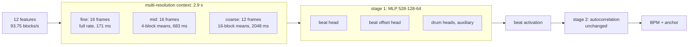
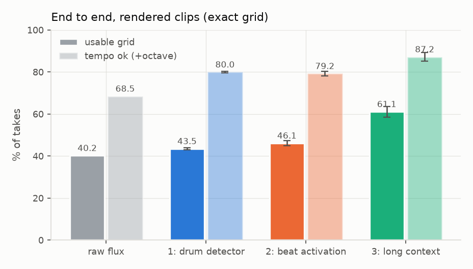
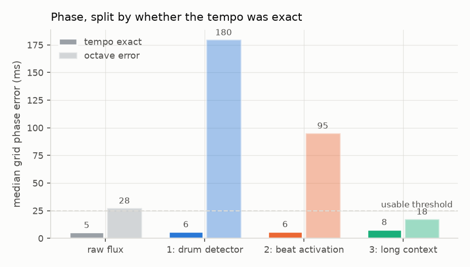

# 3: long context

## Configuration

| | |
|---|---|
| front end | `FE_SPEC_VERSION 1`, variant `hicut` |
| context | 2.87 s, 44 frames, 528 inputs |
| fine | 13 past + 2 future, full rate |
| mid | 16 frames of 4 blocks |
| coarse | 12 frames of 16 blocks |
| model | [128, 64] hidden, beat + offset heads, drum heads auxiliary |
| size | 76,160 MAC/inference, ~74 KB int8 |
| provenance | manifest `a9830eda7ba1`, IR `5279ea9dd9f4` |

## Dataset

| split | takes | blocks | hours | size | beats |
|---|---|---|---|---|---|
| train | 2,382 | 2,846,052 | 8.43 | 244 MB | 59,292 |
| val | 297 | 369,396 | 1.09 | 32 MB | 7,536 |
| test | 276 | 323,631 | 0.96 | 28 MB | 6,510 |
| **total** | 2,955 | 3,539,079 | 10.49 | 304 MB | |

## End to end: rendered clips, exact grid (identical stage 2, 3 seeds)

| approach | usable grid | tempo ok (+octave) | phase, tempo exact | phase, octave error | MACs |
|---|---|---|---|---|---|
| raw flux | 40.2% | 68.5% | 5.4 ms | 27.5 ms | 0 |
| 1: drum detector | 43.5% ±0.5 | 80.0% ±0.5 | 6.0 ms | 179.8 ms | 33,216 |
| 2: beat activation | 46.1% ±1.1 | 79.2% ±1.0 | 6.2 ms | 95.3 ms | 33,088 |
| 3: long context | 61.1% ±2.5 | 87.2% ±2.0 | 8.1 ms | 17.6 ms | 76,160 |

## Tempo prior: measured from training clip tempos, peak 120 BPM (390 real loops, tempo only)

| approach | rendered: usable | + prior | real loops: tempo | + prior | real loops: +octave | + prior |
|---|---|---|---|---|---|---|
| raw flux | 40.2% | 48.6% | 34.4% | 41.5% | 77.2% | 76.4% |
| 1: drum detector | 43.1% | 57.6% | 41.0% | 46.9% | 79.0% | 83.3% |
| 2: beat activation | 47.1% | 58.7% | 42.8% | 45.6% | 77.9% | 81.0% |
| 3: long context | 57.6% | 65.9% | 47.2% | 47.9% | 82.8% | 84.1% |

