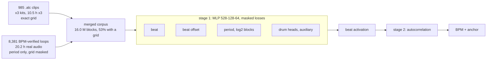

# 4: joint training on real loops

## Configuration

| | |
|---|---|
| front end | `FE_SPEC_VERSION 1`, variant `hicut` |
| context | 2.87 s, 44 frames, 528 inputs |
| model | [128, 64] hidden, beat + offset + period + drum heads |
| size | 76,224 MAC/inference |
| training | 16.0 M blocks, 53% with a grid, 41 min on RTX 3070 |
| provenance | manifest `a9830eda7ba1`, IR `5279ea9dd9f4` |

## Rendered clips, exact grid (2 seeds)

| stage 2 prior | usable grid | tempo ok (+octave) |
|---|---|---|
| none | 69.7% ±1.2 | 89.9% ±0.5 |
| global, measured | 73.1% ±0.0 | 85.0% ±0.3 |
| per-take, learned period head | 69.6% | 82.4% |
| both | 66.3% | 78.9% |

| comparison, no prior | usable grid |
|---|---|
| 3: 3x clips only | 68.0% |
| 4: + 20 h real loops | 69.7% ±1.2 |

## Held-out real drum loops (817 takes, 163 min)

| model | tempo | + prior | +octave | + prior |
|---|---|---|---|---|
| 3: 3x clips only | 53.7% | 47.0% | 89.2% | 82.7% |
| 4: clips + 20 h loops | 54.7% | 47.1% | 89.0% | 82.9% |

## Period head, measured alone

| metric | value |
|---|---|
| median error | 11.12% |
| within 4% | 17.5% |
| within 10% | 45.0% |
| autocorrelation, when it resolves | 0.05% |
