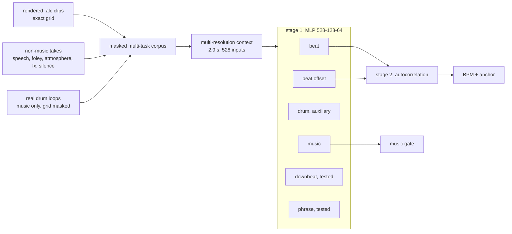
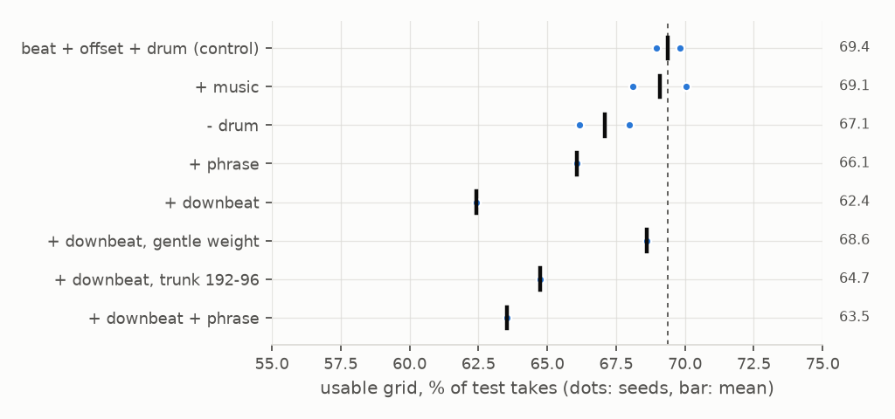
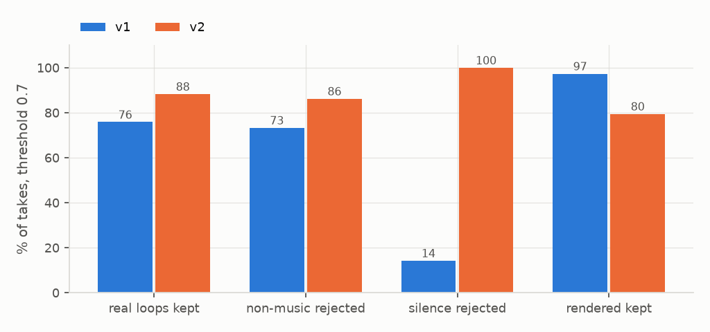

# 5: multi-task heads

## Configuration

| | |
|---|---|
| front end | `FE_SPEC_VERSION 1`, variant `hicut` (2) |
| context | 2.87 s, 44 frames, 528 inputs |
| model | [128, 64] hidden, heads selectable (`train/grid5.py`) |
| size | 76,224 MAC/inference, 86,048 B int8 with music head |
| music labels | silence: past 683 ms mean spl < 52 dB is 0; real loops 1; positive weight 0.3 |
| provenance | manifest `a9830eda7ba1` (2026-09-20), `b38ec7dd9e96` (2026-09-24); IR `5279ea9dd9f4` |

## Dataset

| corpus | split | takes | blocks | hours | size |
|---|---|---|---|---|---|
| rendered clips, 2026-09-20 | train | 7,146 | 8,538,156 | 25.30 | 863 MB |
| rendered clips, 2026-09-20 | val | 891 | 1,108,188 | 3.28 | 112 MB |
| rendered clips, 2026-09-20 | test | 828 | 970,893 | 2.88 | 98 MB |
| rendered clips, 2026-09-24 | train | 8,127 | 9,576,306 | 28.37 | 968 MB |
| rendered clips, 2026-09-24 | val | 1,035 | 1,261,899 | 3.74 | 128 MB |
| rendered clips, 2026-09-24 | test | 945 | 1,084,383 | 3.21 | 110 MB |
| non-music | train | 2,144 | 2,412,000 | 7.15 | 253 MB |
| non-music | val | 268 | 301,500 | 0.89 | 32 MB |
| non-music | test | 239 | 268,875 | 0.80 | 28 MB |
| real drum loops | train | 6,601 | 7,426,125 | 22.00 | 666 MB |
| real drum loops | val | 810 | 911,250 | 2.70 | 82 MB |
| real drum loops | test | 817 | 919,125 | 2.72 | 82 MB |

## Heads: rendered clips, test split

| heads | usable grid | tempo ok (+octave) | phase, tempo exact | real loops: tempo | downbeat F1 | MACs |
|---|---|---|---|---|---|---|
| beat + offset + drum (control) | 69.4% ±0.4 | 90.5% ±0.4 | 5.87 ms ±0.00 | 53.1% ±0.7 |  | 76,160 |
| + music | 69.1% ±1.0 | 89.7% ±0.2 | 6.11 ms ±0.00 | 53.0% ±0.0 |  | 76,224 |
| - drum | 67.1% ±0.9 | 90.3% ±0.2 | 5.97 ms ±0.63 | 53.0% ±0.5 |  | 75,904 |
| + phrase | 66.1% | 88.6% | 5.87 ms | 53.0% |  | 76,224 |
| + downbeat | 62.4% | 87.1% | 5.86 ms | 51.2% | 0.378 | 76,288 |
| + downbeat, gentle weight | 68.6% | 89.9% | 5.96 ms | 52.9% | 0.310 | 76,288 |
| + downbeat, trunk 192-96 | 64.7% | 88.0% | 6.24 ms | 51.2% |  | 120,576 |
| + downbeat + phrase | 63.5% | 88.0% | 5.57 ms | 49.8% |  | 76,352 |

## Music gate: per-take median, val split, threshold 0.7

| music head | real loops kept | non-music rejected | silence rejected | rendered kept | usable grid |
|---|---|---|---|---|---|
| v1: music head | 75.9% ±0.4 | 73.3% ±0.4 | 14.3% ±0.0 | 97.4% ±0.2 | 69.1% ±1.0 |
| + silence is not music | 75.6% | 74.6% | 100.0% | 89.0% | 62.7% |
| + real loops as music | 96.0% | 60.4% | 7.1% | 96.4% | 63.9% |
| + both | 96.3% ±0.0 | 61.0% ±0.2 | 92.9% ±0.0 | 90.0% ±0.4 | 67.5% ±0.4 |
| + both, music weight 0.3 | 87.2% ±0.3 | 85.2% ±0.2 | 100.0% ±0.0 | 77.6% ±0.6 | 69.1% ±0.0 |
| v2: + both, weight 0.3, 2026-09-24 index | 88.3% ±0.1 | 86.2% ±0.4 | 100.0% ±0.0 | 79.5% ±0.1 | 70.8% ±0.1 |

## Front end: hi-cut, 2 seeds, 985 clips each

| front end | usable grid | tempo ok (+octave) | phase, tempo exact | real loops: tempo |
|---|---|---|---|---|
| hi-cut 4 kHz (variant 2) | 68.5% ±0.1 | 90.4% ±0.9 | 5.82 ms ±0.22 | 52.1% ±0.3 |
| open (variant 0) | 65.2% ±2.7 | 90.8% ±0.1 | 6.44 ms ±0.20 | 52.6% ±0.1 |

## Corpus: music v2, 2 seeds

| training index | usable, 2026-09-20 test (828 takes) | usable, 2026-09-24 test (945 takes) |
|---|---|---|
| 2026-09-20 index, 985 clips | 69.1% ±0.0 | 61.5% ±0.5 |
| 2026-09-24 index, 1,123 clips | 70.8% ±0.1 | 62.5% ±0.7 |

## Training pipeline, same heads (beat, offset, drum, music)

| pipeline | usable grid | phase, tempo exact | minutes per run |
|---|---|---|---|
| numpy batches, eager step | 69.1% ±1.0 | 6.11 ms ±0.00 | 25.0 |
| GPU-resident, XLA step | 68.2% ±0.7 | 5.82 ms ±0.19 | 3.4 |
