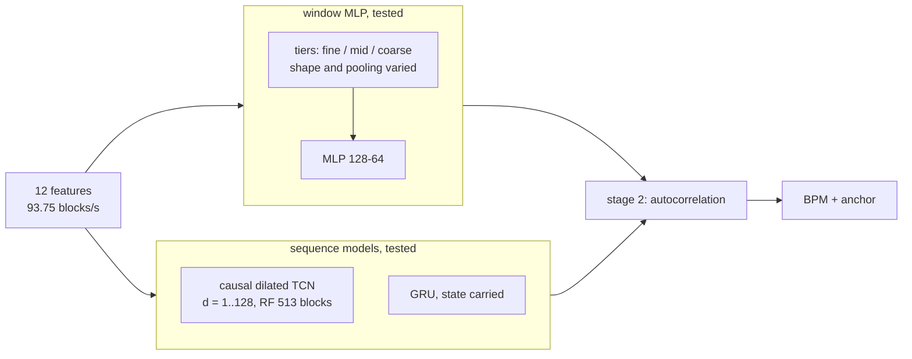
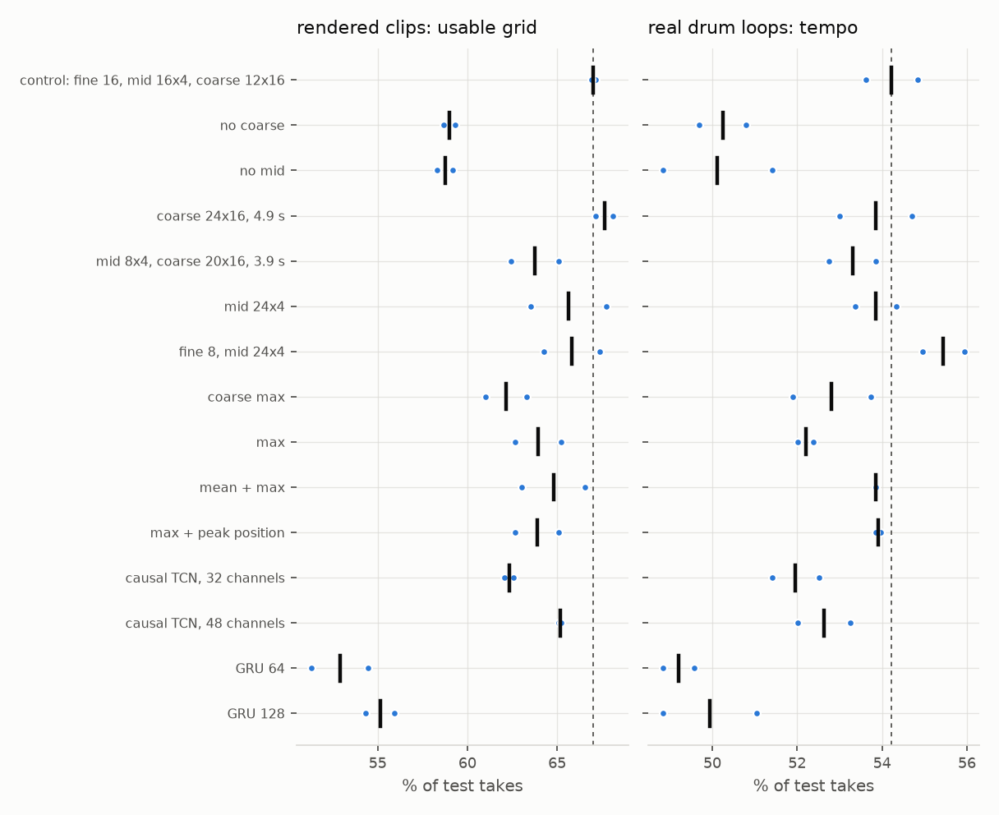

# 6: context shape, pooling, sequence models

## Configuration

| | |
|---|---|
| front end | `FE_SPEC_VERSION 1`, variant `hicut` (2) |
| training | rendered clips, 2026-09-20 index (`data/features3`); beat, offset, drum heads |
| window models | `train/grid5.py`, flags `--mid --coarse --fine-past --mid-pool --coarse-pool` |
| sequence models | `train/seq.py`: whole takes, causal, 2-block lookahead as the MLP |
| scoring | `train/compare.py`: blocks from 461 into each take, every model (the longest lookback tested) |

## Inference-time ablation, control model, 269-block window

| frames replaced | blank: usable | blank: tempo +octave | shuffle: usable |
|---|---|---|---|
| none | 69.7% ±1.3 | 90.7% ±0.6 | 69.7% ±1.3 |
| fine | 38.6% ±0.8 | 74.2% ±0.4 | 16.8% ±1.5 |
| fine, oldest 8 | 67.8% ±0.3 | 88.7% ±0.5 | 65.3% ±0.6 |
| mid | 54.0% ±0.7 | 80.6% ±0.7 | 51.9% ±0.8 |
| coarse | 57.5% ±0.4 | 84.7% ±0.1 | 54.0% ±0.7 |
| coarse, oldest 6 | 64.8% ±0.9 | 87.7% ±0.4 | 62.6% ±0.5 |
| mid + coarse | 50.0% ±0.1 | 79.8% ±0.1 | 46.7% ±0.5 |

## Context shape, retrained

| configuration | rendered: usable | rendered: tempo +octave | real drum loops: tempo | melodic loops: tempo | MACs | seeds |
|---|---|---|---|---|---|---|
| control: fine 16, mid 16x4, coarse 12x16 | 67.0% ±0.1 | 90.8% ±0.7 | 54.2% ±0.6 | 35.8% ±0.1 | 76,160 | 2 |
| no coarse | 59.0% ±0.3 | 86.5% ±0.2 | 50.2% ±0.6 | 35.7% ±0.4 | 57,728 | 2 |
| no mid | 58.8% ±0.4 | 85.0% ±0.2 | 50.1% ±1.3 | 34.8% ±0.3 | 51,584 | 2 |
| coarse 24x16, 4.9 s | 67.6% ±0.5 | 90.2% ±0.2 | 53.9% ±0.9 | 35.3% ±0.4 | 94,592 | 2 |
| mid 8x4, coarse 20x16, 3.9 s | 63.8% ±1.3 | 89.3% ±0.5 | 53.3% ±0.6 | 34.0% ±0.1 | 76,160 | 2 |
| mid 24x4 | 65.6% ±2.1 | 90.1% ±0.1 | 53.9% ±0.5 | 37.1% ±0.9 | 88,448 | 2 |
| fine 8, mid 24x4 | 65.8% ±1.6 | 90.0% ±0.3 | 55.4% ±0.5 | 38.5% ±0.1 | 76,160 | 2 |

## Pooling of mid and coarse tiers, retrained

| configuration | rendered: usable | rendered: tempo +octave | real drum loops: tempo | melodic loops: tempo | MACs | seeds |
|---|---|---|---|---|---|---|
| mean (control) | 67.0% ±0.1 | 90.8% ±0.7 | 54.2% ±0.6 | 35.8% ±0.1 | 76,160 | 2 |
| coarse max | 62.1% ±1.1 | 88.1% ±0.2 | 52.8% ±0.9 | 35.0% ±1.5 | 76,160 | 2 |
| max | 63.9% ±1.3 | 87.6% ±0.7 | 52.2% ±0.2 | 36.4% ±0.3 | 76,160 | 2 |
| mean + max | 64.8% ±1.8 | 87.9% ±0.1 | 53.9% ±0.0 | 35.2% ±0.7 | 119,168 | 2 |
| max + peak position | 63.9% ±1.2 | 88.2% ±0.5 | 53.9% ±0.1 | 38.9% ±1.3 | 119,168 | 2 |

## Sequence models

| configuration | rendered: usable | rendered: tempo +octave | real drum loops: tempo | melodic loops: tempo | rendered: phase, octave error | MACs | seeds |
|---|---|---|---|---|---|---|---|
| window MLP 528-128-64 (control) | 67.0% ±0.1 | 90.8% ±0.7 | 54.2% ±0.6 | 35.8% ±0.1 | 15.7 ms ±0.5 | 76,160 | 2 |
| causal TCN, 32 channels | 62.3% ±0.2 | 92.4% ±0.7 | 52.0% ±0.6 | 37.6% ±1.0 | 24.8 ms ±9.6 | 28,160 | 2 |
| causal TCN, 48 channels | 65.2% ±0.1 | 92.8% ±0.2 | 52.6% ±0.6 | 37.1% ±0.9 | 17.1 ms ±0.9 | 60,480 | 2 |
| GRU 64 | 52.9% ±1.6 | 84.1% ±0.4 | 49.2% ±0.4 | 36.6% ±0.4 | 48.6 ms ±14.1 | 19,456 | 2 |
| GRU 128 | 55.1% ±0.8 | 84.4% ±1.1 | 49.9% ±1.1 | 35.1% ±0.4 | 125.7 ms ±12.2 | 63,104 | 2 |

