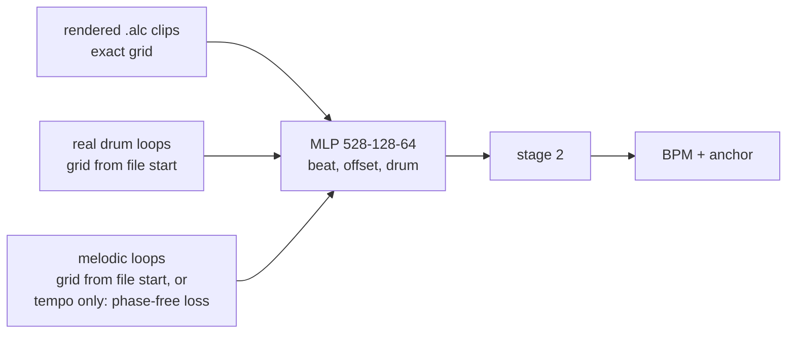
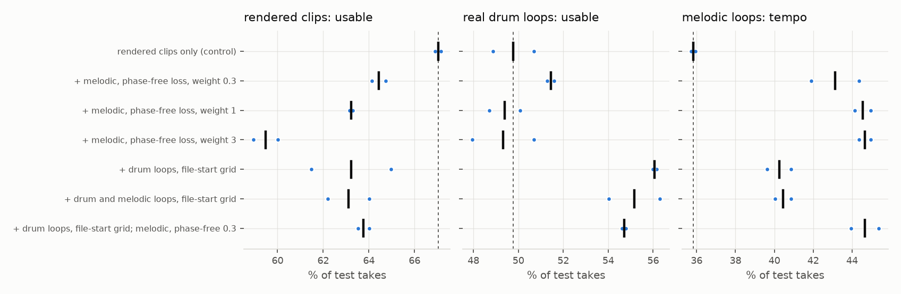

# 7: real loops with a file-start grid

## Configuration

| | |
|---|---|
| front end | `FE_SPEC_VERSION 1`, variant `hicut` (2); loop corpora built at v2, bit-identical |
| model | window MLP 528-128-64, beat + offset + drum heads, 76,160 MACs |
| drum and melodic grid | `dataset/loopset.py --grid --max-len-err 5e-4`: beats at k*60/bpm from the file start |
| melodic loops | no Drums tag, BPM verified, backing-bed packs excluded |
| phase-free loss | per 512-block segment, BCE against the grid at every 1/3-block phase of the known period; the best phase counts; +-1 block tolerance |
| scoring | `train/compare.py`, 461-block window |
| provenance | manifest `b38ec7dd9e96` (2026-09-24); IR `5279ea9dd9f4` |

## Dataset

| corpus | split | takes | blocks | hours | size |
|---|---|---|---|---|---|
| rendered clips, 2026-09-20 | train | 7,146 | 8,538,156 | 25.30 | 863 MB |
| rendered clips, 2026-09-20 | val | 891 | 1,108,188 | 3.28 | 112 MB |
| rendered clips, 2026-09-20 | test | 828 | 970,893 | 2.88 | 98 MB |
| real drum loops, file-start grid | train | 5,454 | 6,135,750 | 18.18 | 550 MB |
| real drum loops, file-start grid | val | 660 | 742,500 | 2.20 | 67 MB |
| real drum loops, file-start grid | test | 659 | 741,375 | 2.20 | 66 MB |
| melodic loops, file-start grid | train | 3,598 | 4,047,750 | 11.99 | 363 MB |
| melodic loops, file-start grid | val | 441 | 496,125 | 1.47 | 44 MB |
| melodic loops, file-start grid | test | 473 | 532,125 | 1.58 | 48 MB |
| melodic loops, tempo only | train | 3,731 | 4,197,375 | 12.44 | 376 MB |
| melodic loops, tempo only | val | 461 | 518,625 | 1.54 | 46 MB |
| melodic loops, tempo only | test | 487 | 547,875 | 1.62 | 49 MB |

## Do loops start on a beat? Models trained on rendered clips only, test split

| corpus | model | tempo-exact takes | grid within 25 ms of file start | median | half a beat off |
|---|---|---|---|---|---|
| loops_grid | `runs/e_base` | 339 / 659 | 71.4% | 7.7 ms | 13.0% |
| loops_grid | `runs/i_ctrl_s0` | 349 / 659 | 69.6% | 8.5 ms | 16.0% |
| loops_grid | `runs/i_ctrl_s1` | 335 / 659 | 71.0% | 7.1 ms | 14.9% |
| melodic_grid | `runs/e_base` | 169 / 473 | 56.8% | 18.2 ms | 16.6% |
| melodic_grid | `runs/i_ctrl_s0` | 177 / 473 | 54.8% | 19.0 ms | 19.2% |
| melodic_grid | `runs/i_ctrl_s1` | 168 / 473 | 55.4% | 19.1 ms | 17.3% |

## Training on loops, rendered clips 2026-09-20

| configuration | rendered: usable | real drum: usable | real drum: phase | real drum: tempo | melodic: usable | melodic: phase | melodic: tempo | MACs | seeds |
|---|---|---|---|---|---|---|---|---|---|
| rendered clips only (control) | 67.0% ±0.1 | 49.8% ±0.9 | 9.2 ms ±0.3 | 54.2% ±0.6 | 24.2% ±0.3 | 25.8 ms ±2.8 | 35.8% ±0.1 | 76,160 | 2 |
| + melodic, phase-free loss, weight 0.3 | 64.4% ±0.3 | 51.4% ±0.2 | 8.5 ms ±0.0 | 54.8% ±0.4 | 27.4% ±0.1 | 26.3 ms ±1.0 | 43.1% ±1.2 | 76,160 | 2 |
| + melodic, phase-free loss, weight 1 | 63.2% ±0.1 | 49.4% ±0.7 | 8.8 ms ±0.0 | 54.8% ±0.4 | 27.1% ±0.0 | 30.0 ms ±1.2 | 44.6% ±0.4 | 76,160 | 2 |
| + melodic, phase-free loss, weight 3 | 59.5% ±0.5 | 49.3% ±1.4 | 10.3 ms ±1.1 | 54.6% ±0.5 | 26.2% ±0.6 | 30.7 ms ±1.0 | 44.7% ±0.3 | 76,160 | 2 |
| + drum loops, file-start grid | 63.2% ±1.8 | 56.1% ±0.1 | 6.6 ms ±0.1 | 59.0% ±0.4 | 28.8% ±0.2 | 20.3 ms ±1.2 | 40.2% ±0.6 | 76,160 | 2 |
| + drum and melodic loops, file-start grid | 63.1% ±0.9 | 55.2% ±1.1 | 7.2 ms ±0.1 | 58.8% ±0.1 | 30.3% ±0.3 | 15.6 ms ±0.7 | 40.5% ±0.4 | 76,160 | 2 |
| + drum loops, file-start grid; melodic, phase-free 0.3 | 63.8% ±0.2 | 54.7% ±0.1 | 7.1 ms ±0.3 | 59.9% ±0.4 | 27.8% ±1.0 | 27.3 ms ±0.7 | 44.7% ±0.7 | 76,160 | 2 |

## Full configuration, rendered clips 2026-09-24 (945 test takes), music head on

| configuration | rendered: usable | real drum: usable | real drum: phase | real drum: tempo | melodic: usable | melodic: phase | melodic: tempo | MACs | seeds |
|---|---|---|---|---|---|---|---|---|---|
| music v2, delivered (g_music2) | 60.3% ±0.7 | 50.2% ±1.7 | 8.3 ms ±0.2 | 54.6% ±0.6 | 23.9% ±0.0 | 30.6 ms ±2.4 | 37.2% ±1.2 | 76,224 | 2 |
| + drum loops, file-start grid; melodic, phase-free 0.3 | 58.7% ±0.2 | 55.0% ±0.5 | 7.3 ms ±0.2 | 58.9% ±0.2 | 29.8% ±0.2 | 23.3 ms ±1.1 | 45.6% ±0.2 | 76,224 | 2 |

## Music gate, per-take median, val split, threshold 0.7

| model | real loops kept | non-music rejected | silence rejected | rendered kept |
|---|---|---|---|---|
| music v2, seed 0 | 88.3% | 86.7% | 100.0% | 79.4% |
| candidate, 2 seeds | 88.3% ±0.2 | 86.9% ±0.2 | 100.0% ±0.0 | 80.0% ±0.3 |

