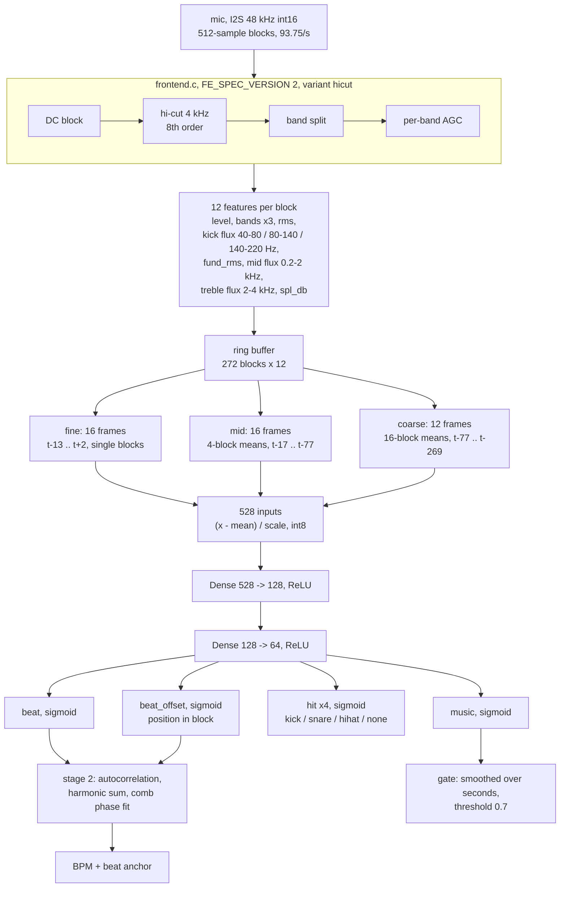
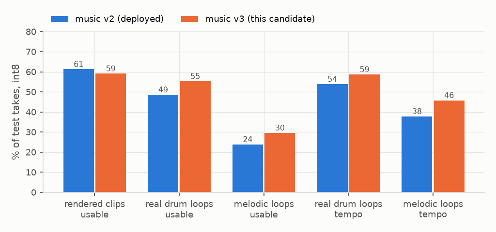
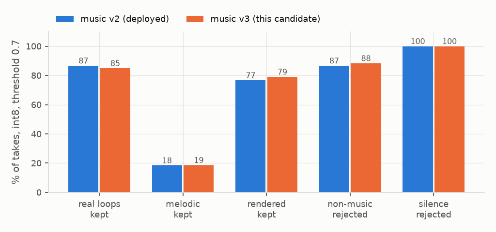
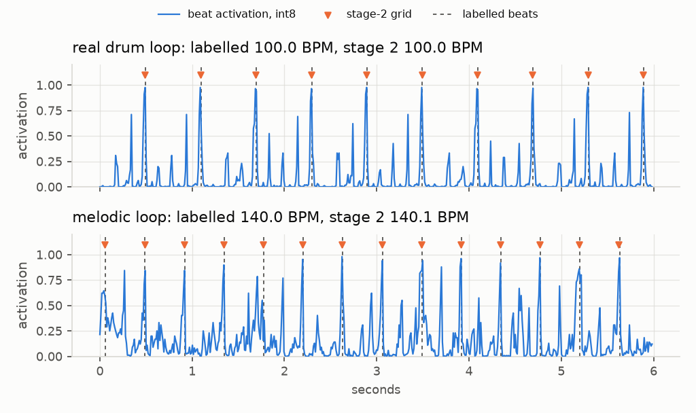

# 8: deploy candidate, music v3

## Configuration

| | |
|---|---|
| front end | `FE_SPEC_VERSION` 2 (recorded 1), variant `hicut` (2) |
| context | 2.87 s, 44 frames, 528 inputs, ring 272 blocks, lookahead 2 blocks (21.3 ms) |
| model | MLP 528-128-64, ReLU, dropout 0.1 in training; heads beat (1), beat_offset (1), hit (4), music (1) |
| size | 76,224 MACs per block, 86,048 B int8 TFLite |
| run | `runs/m_cand_s0`, seed 0, 9.3 min on RTX 3070, 18,124,056 training blocks |
| losses | beat: BCE, positive weight 20; offset: MSE on beats, weight 5; drum: BCE, weight 0.3; music: BCE, positive weight 0.3; melodic: phase-free BCE, weight 0.3 |
| export | int8 in and out, calibration on rendered + noise + drum loops + melodic loops; sha256 `a88ce6d7a986` |
| provenance | manifest `b38ec7dd9e96`, IR `5279ea9dd9f4`, commit `0a5e964` |

## Training pool

| corpus | train takes | hours | beat + offset | drum | music | melodic loss |
|---|---|---|---|---|---|---|
| rendered .alc clips, 2026-09-24 index | 8,127 | 28.4 | exact grid | per hit | 1, silence 0 | - |
| real drum loops, file-start grid | 5,454 | 18.2 | file-start grid | masked | 1 | - |
| melodic loops | 3,731 | 12.4 | masked | masked | 1 | phase-free, known tempo |
| non-music takes | 2,144 | 7.1 | masked | masked | 0 | - |

## Music positives: melodic loops as music, gate per-take median, val, float

| configuration | music weight | threshold | real loops kept | melodic kept | rendered kept | non-music rejected | silence rejected | rendered usable | drum usable | melodic tempo | seeds |
|---|---|---|---|---|---|---|---|---|---|---|---|
| music v2, delivered | 0.3 | 0.7 | 88.3% ±0.1 | 22.3% ±0.2 | 79.5% ±0.1 | 85.6% ±0.2 | 100.0% ±0.0 | 60.3% ±0.7 | 50.2% ±1.7 | 37.2% ±1.2 | 2 |
| v3: drum grid + melodic phase-free (chosen) | 0.3 | 0.7 | 88.3% ±0.2 | 21.4% ±0.5 | 80.0% ±0.2 | 87.1% ±0.0 | 100.0% ±0.0 | 58.7% ±0.2 | 55.0% ±0.5 | 45.6% ±0.2 | 2 |
| v3 + melodic loops as music | 0.3 | 0.7 | 92.1% ±0.4 | 52.2% ±0.1 | 85.3% ±0.3 | 79.0% ±0.6 | 100.0% ±0.0 | 59.3% ±1.1 | 54.6% ±0.9 | 45.1% ±0.9 | 2 |
| v3 + melodic loops as music | 0.15 | 0.7 | 79.6% ±0.2 | 18.4% ±0.2 | 74.9% ±0.2 | 89.0% ±0.2 | 100.0% ±0.0 | 58.6% ±0.1 | 55.6% ±0.4 | 45.0% ±0.2 | 2 |
| v3 + melodic loops as music | 0.08 | 0.7 | 63.1% ±0.9 | 5.7% ±0.1 | 63.6% ±1.0 | 95.2% ±0.2 | 100.0% ±0.0 | 57.3% ±1.0 | 53.9% ±0.4 | 44.5% ±0.1 | 2 |
| music v2, delivered | 0.3 | 0.8 | 81.0% ±0.5 | 13.3% ±0.3 | 74.3% ±0.5 | 90.6% ±0.2 | 100.0% ±0.0 | 60.3% ±0.7 | 50.2% ±1.7 | 37.2% ±1.2 | 2 |
| v3: drum grid + melodic phase-free (chosen) | 0.3 | 0.8 | 80.5% ±0.4 | 13.3% ±0.1 | 75.3% ±0.1 | 89.8% ±0.2 | 100.0% ±0.0 | 58.7% ±0.2 | 55.0% ±0.5 | 45.6% ±0.2 | 2 |
| v3 + melodic loops as music | 0.3 | 0.8 | 82.2% ±0.2 | 23.3% ±0.8 | 77.3% ±0.2 | 87.3% ±0.2 | 100.0% ±0.0 | 59.3% ±1.1 | 54.6% ±0.9 | 45.1% ±0.9 | 2 |
| v3 + melodic loops as music | 0.15 | 0.8 | 68.3% ±0.7 | 8.5% ±1.3 | 67.5% ±0.7 | 93.3% ±0.0 | 100.0% ±0.0 | 58.6% ±0.1 | 55.6% ±0.4 | 45.0% ±0.2 | 2 |
| v3 + melodic loops as music | 0.08 | 0.8 | 49.7% ±0.8 | 2.2% ±0.2 | 50.3% ±1.2 | 97.5% ±0.0 | 100.0% ±0.0 | 57.3% ±1.0 | 53.9% ±0.4 | 44.5% ±0.1 | 2 |

## Float against int8, test split, 461-block window

| test set | metric | v2 float | v2 int8 | v3 float | v3 int8 | v3 activation correlation |
|---|---|---|---|---|---|---|
| rendered clips, 2026-09-24 | usable | 61.0% | 61.3% | 58.9% | 59.0% | 0.9942 |
| real drum loops | usable | 48.4% | 48.6% | 54.5% | 55.2% | 0.9945 |
| melodic loops | usable | 23.9% | 23.9% | 29.6% | 29.6% | 0.9931 |
| real drum loops | tempo | 54.0% | 53.9% | 58.8% | 58.6% | 0.9951 |
| melodic loops | tempo | 38.4% | 37.8% | 45.4% | 45.8% | 0.9931 |
| rendered clips | phase, tempo exact | 8.8 ms | 9.2 ms | 9.4 ms | 9.3 ms | |
| real drum loops | phase, tempo exact | 8.6 ms | 8.7 ms | 7.6 ms | 7.4 ms | |
| melodic loops | phase, tempo exact | 33.0 ms | 33.5 ms | 24.4 ms | 25.3 ms | |

## Music gate, int8, val, threshold 0.7

| model | real loops | melodic | rendered | non-music | silence |
|---|---|---|---|---|---|
| music v2 (deployed) | 86.7% | 18.4% | 76.7% | 86.7% | 100.0% |
| music v3 | 84.9% | 18.7% | 79.0% | 88.3% | 100.0% |

## Example: int8 beat activation on held-out loops, first usable take of a seeded shuffle

