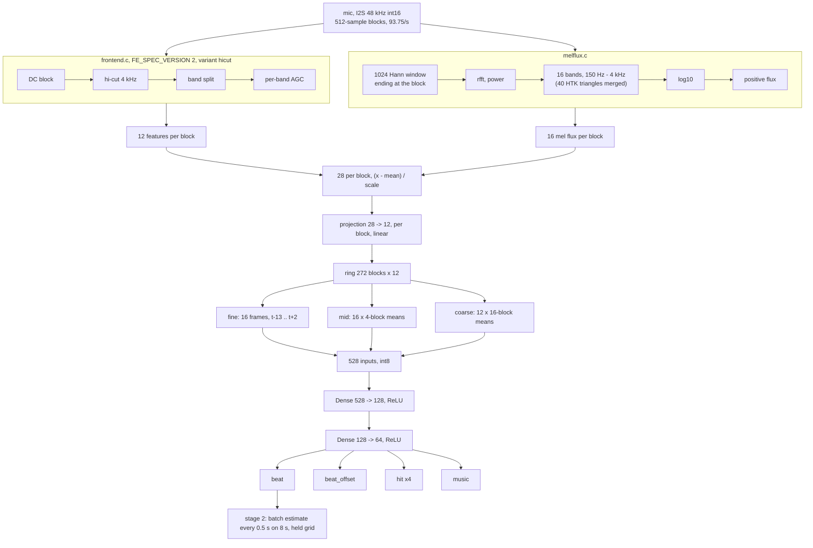
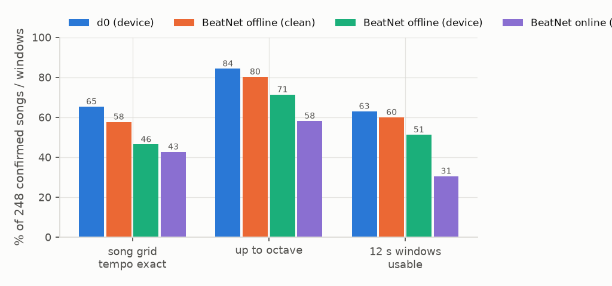
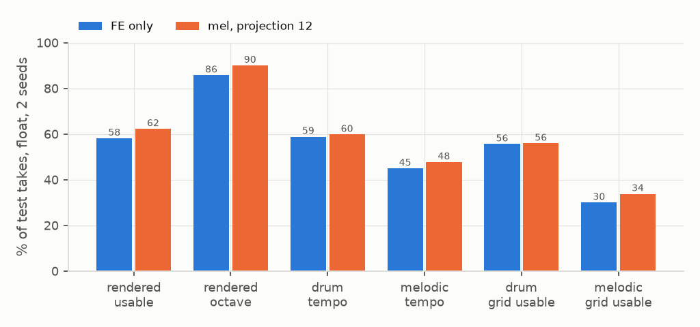

# 9: mel flux and real songs, model d0

## Configuration

|  |  |
|---|---|
| front end | `FE_SPEC_VERSION` 2, variant `hicut`, plus `melflux.c` (training: numpy prototype, agrees to 1.2e-5) |
| mel | 1024 Hann ending at the block, rfft power, 40 HTK triangles 150 Hz - 4 kHz merged to 16 bands, log10, positive flux |
| per block | 12 FE + 16 mel flux = 28, projected to 12 (learned, linear, applied per frame) |
| context | 2.87 s, 44 frames x 12 = 528 inputs, ring 272 blocks, lookahead 2 blocks |
| model | projection 28 -> 12, MLP 528-128-64, heads beat, beat_offset, hit x4, music |
| size | 76,560 MACs per block (336 projection + 76,224 trunk) |
| training pool | rendered clips, noise, drum loops (file-start grid), melodic loops (phase-free), hand-labelled songs, playlists |

## Songs

|  |  |
|---|---|
| source | songs/likes.csv, 323 tracks, 293 fetched (yt-dlp, duration-matched) |
| labels | 293 by hand in `labeler`: 248 confirmed grids, 38 variable tempo, 7 non-rhythmic |
| label | constant-tempo grid (bpm, t0) on the file timeline; excluded spans masked |
| pre-annotation | dataset.songgrid: 12 s locks, grid grown from the longest run, verdicts shown for review |
| playlists | 6 excerpts of 40-90 s per take, hard cut 40% / gap 0.5-2.5 s 20% / crossfade 3-12 s 40%; crossfades masked |

## Capacity and context, 2 seeds, control n_song (v3 recipe + songs)

| run | MACs | rendered usable | rendered octave | drum tempo | melodic tempo | drum grid usable | melodic grid usable | rendered phase, ms | songs test | songs val | lock share, pt |
|---|---|---|---|---|---|---|---|---|---|---|---|
| control | 76,224 | 58.9 ±0.3 | 87.0 ±0.1 | 58.9 ±0.7 | 45.8 ±0.4 | 54.5 ±0.8 | 29.4 ±0.8 | 9.4 ±0.1 | 58.3 ±2.2 | 68.9 ±3.7 | +2.9 [+0.6, +5.1] vs v3 |
| wide 224-64 | 133,056 | 59.8 ±1.0 | 86.5 ±0.8 | 60.0 ±0.4 | 46.5 ±0.7 | 56.5 ±1.1 | 29.1 ±1.0 | 9.3 ±0.0 | 54.8 ±0.4 | 68.9 ±0.7 | +1.2 [-1.1, +3.4] |
| coarse 24 x 16 | 94,656 | 59.0 ±1.6 | 88.8 ±0.5 | 60.7 ±0.4 | 47.1 ±0.1 | 55.5 ±0.2 | 31.5 ±0.4 | 9.6 ±0.3 | 59.2 ±2.2 | 69.3 ±1.1 | -2.4 [-5.1, +0.4] |
| wide + coarse 24 | 165,312 | 61.8 ±0.0 | 88.5 ±1.0 | 60.3 ±0.3 | 47.6 ±0.2 | 56.7 ±0.8 | 31.3 ±0.2 | 9.1 ±0.2 | 55.7 ±0.4 | 70.0 ±1.1 | +0.9 [-1.8, +3.6] |
| songs rendered 3x | 76,224 | 56.6 ±0.5 | 85.9 ±0.5 | 58.9 ±0.2 | 45.4 ±0.4 | 54.3 ±0.3 | 29.9 ±0.7 | 9.7 ±0.3 | 56.6 ±3.1 | 67.8 ±1.1 | +1.8 [-0.8, +4.2] |

## Mel, 2 seeds, rebuilt pool

| run | MACs | rendered usable | rendered octave | drum tempo | melodic tempo | drum grid usable | melodic grid usable | rendered phase, ms | songs test | songs val | lock share, pt |
|---|---|---|---|---|---|---|---|---|---|---|---|
| control, FE only | 76,224 | 58.1 ±0.9 | 85.8 ±0.3 | 58.9 ±0.2 | 45.0 ±0.2 | 55.6 ±0.2 | 30.0 ±0.0 | 9.6 ±0.2 | 58.3 ±1.3 | 67.4 ±0.0 | - |
| mel flux 16, no projection | 166,336 | 63.7 ±0.6 | 91.1 ±0.1 | 59.1 ±0.6 | 48.5 ±0.4 | 56.3 ±0.2 | 34.8 ±0.5 | 9.0 ±0.2 | 60.5 ±0.0 | 69.6 ±0.7 | +1.8 [-0.6, +4.3] |
| mel flux 16, projection 12 | 76,560 | 62.3 ±0.1 | 90.1 ±0.2 | 59.8 ±1.0 | 47.7 ±0.3 | 55.9 ±0.2 | 33.8 ±0.6 | 8.5 ±0.1 | 60.1 ±0.4 | 67.0 ±2.6 | +4.5 [+2.1, +6.9] |
| mel flux 16, projection 16 | 99,200 | 60.8 ±1.7 | 89.9 ±1.0 | 58.8 ±0.1 | 47.8 ±0.4 | 54.7 ±0.7 | 33.2 ±0.0 | 9.1 ±0.3 | 58.8 ±1.8 | 67.0 ±1.9 | - |
| mel flux 16, projection 12, music labels fixed | 76,560 | 61.7 ±0.4 | 90.7 ±0.3 | 59.4 ±0.3 | 48.9 ±0.2 | 56.2 ±0.1 | 34.9 ±0.0 | 8.6 ±0.2 | - | - | - |

Lock share for b1 and b2 is against b0; unlabelled songs of 2026-09-28, 189. b1-b3 (and every mel run before 2026-09-29) trained the music head on labels that were all 0: `grid5.silent` read loudness from the last column, which mel moved. b2fix is b2 with it fixed.

## Real songs, 5-fold CV by artist (all 293 labels), d0

| songs | 12 s windows | usable | tempo exact | tempo up to octave | usable per fold |
|---|---|---|---|---|---|
| 293 | 3244 | 69.8 | 68.8 | 88.9 | 69.9 / 71.5 / 71.0 / 67.7 / 68.7 |

## Against BeatNet (Heydari et al. 2021, model 1), 248 confirmed songs

|  | BeatNet | d0 |
|---|---|---|
| parameters | 402,325 | 76,560 |
| MACs per frame | ~405k | 76,560 |
| frames per second | 50 | 93.75 |
| MAC/s | ~20M | ~7.2M |
| weights | 1.6 MB float32 | 84 KB int8 |
| causal | online mode only (particle filter) | yes, 2 blocks lookahead |
| training data | Ballroom, GTZAN, Beatles, RWC, Rock Corpus | own corpora + these songs' other folds |

| method | song grid tempo exact | up to octave | phase median | phase within 25 ms | 12 s windows usable | F, 70 ms |
|---|---|---|---|---|---|---|
| d0, device audio, held-out fold model | 65.3 | 84.3 | 2.8 ms | 81.8 | 63.0 | 57.3 |
| BeatNet offline (DBN), clean audio | 57.7 | 80.2 | 4.6 ms | 85.4 | 60.0 | 70.2 |
| BeatNet offline (DBN), device audio | 46.4 | 71.4 | 12.0 ms | 83.1 | 51.2 | 65.3 |
| BeatNet online (PF), clean audio | 54.8 | 73.8 | 5.8 ms | 88.0 | 44.7 | 51.8 |
| BeatNet online (PF), device audio | 42.7 | 58.1 | 16.1 ms | 76.2 | 30.5 | 46.8 |

Every method through the same stage 2 (tempo.estimate on its events, then one grid fitted through them). Song grid right (tempo exact, phase within 25 ms at mid-song), 248 songs: both 73, d0 only 72, BeatNet only 51, neither 52.

